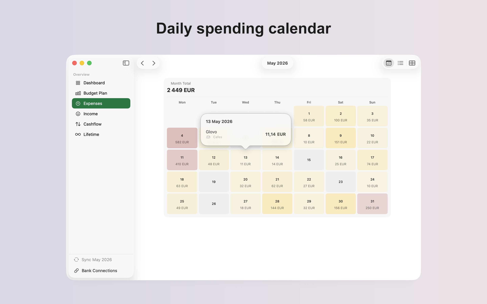

# Wise Budget

A native macOS budgeting app that syncs directly with your [Wise](https://wise.com) and [Monobank](https://www.monobank.ua) accounts, tracks expenses and income across multiple currencies, and helps you plan and follow a monthly budget.

## Features

- **Bank sync** — pulls transactions directly from the Wise and Monobank APIs, with automatic deduplication and categorization (merchant keywords for Wise, MCC codes for Monobank).
- **Multi-currency** — every expense and income entry tracks its original amount/currency alongside a converted base-currency amount, using historical exchange rates.
- **Budget planning** — set a monthly budget per category and track pacing against actual spending.
- **Dashboard, Cashflow & Lifetime views** — see spending at a glance, month-over-month cashflow, and lifetime totals.
- **Daily spending calendar** — a calendar view of daily totals with per-transaction detail on hover.
- **CSV import/export** — import historical Wise/Monobank CSV exports, or your own app data, and export everything for backup.

## Requirements

- macOS 26.2 or later
- Xcode 26 or later

Bank sync requires a Wise API token and/or a Monobank API token, entered in-app and stored in the Keychain — no external configuration files needed.

## Tech stack

- Swift 6.0 with strict concurrency checking; default actor isolation is `MainActor` (approachable concurrency), with explicit `nonisolated`/background work only where needed (e.g. API clients, importers)
- SwiftUI (`NavigationSplitView`, 3-column layout)
- SwiftData (`@Model`, `@Query`)
- Swift Testing for unit tests
- No external dependencies
